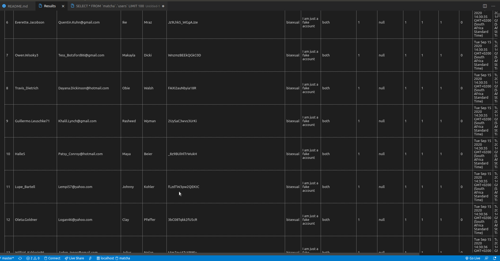

# Matcha
 This project is about creating a dating website.

# HOW TO USE

## Node Setup

1. Run `cd` until you are in the same folder as `package.json`
2. Run `npm install`, this will allow the npm to install all dependencies
	required to make the application run.
NB: Ensure that __port 4500__ is free and that no service is currently using it, a new port can
be defined in `api/server.js`

##### !Shortcut - Notice!
###### `npm run build`
##### !-----------------!

3. Run `node start.js` at least once! This will create the database
4. Run npm start. If this has run successfully, the console will print:
	> Matcha has started running/listening on port 5000!

##### SEEDED MySQL Database

## MYSQL SETUP AND TEST

1. Run `sudo apt-get install mysql-server mysql-client`
2. Run `sudo -u root -p` enter your sudo password if it requests the sudo password
	or leave it blank if it is the MySql password, assuming you have not previously
	entered a MySql password.
3. With the `mysql>` prompt enter the following
	`ALTER USER 'root'@'localhost' identified WITH mysql_native_password BY 'password';`

	- Note that this changes the password to password so you may alter the above statement
		in that regard.
4.	Run `service mysql restart` or `service mysql stop` followed by `service mysql start`
	- Install MySQL Workbench to use a GUI
5.	Test the success of your work by opening a terminal and running `node start.js`
	- if it is successful
	> MySQL Database has Connected
	will be printed in the console.
	- if unsuccessful the console will return an error.

__FINALLY RUN__ `node server.js`